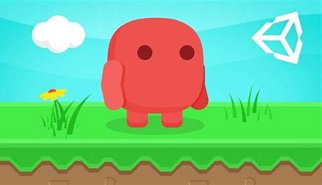

# **RunningForSuccess**

  *"Never Look Back"*

Link to Github For RunningForSuccess: [https://github.com/gstieg/RunningForSuccess]

# **About**

        RunningForSuccess was made for a Portfolio Project at Holberton School [https://www.holbertonschool.com/]. This project was made in Unity
        and has some C# code in it as well. The story behind the creation of this game is related to life. In the way
        that in life you run into obstacles, have to face different things. This game is a small representation of that.
        Throughout the game, you see you have to avoid different obstacles including (spikes, and water) if you don't you
        will have to start the game at the beginning. In each level, there are coins you can collect aka "money" to relate
        to the real world.

# **Features**

Coin (currency) - used this feature to relate to the real worlds currency (USD)

Spikes (enemy) - Added this to signify obastacles you have to overcome in the real world

Water (enemy) - Added this to signify obastacles you have to overcome in the real world

**Authors**

**Grayson Stiegler**, [https://github.com/gstieg] | (https://twitter.com/gstieg0809)
		      (https://www.linkedin.com/in/grayson-stiegler-43714017a/)
		      (https://github.com/gstieg/RunningForSuccess)
